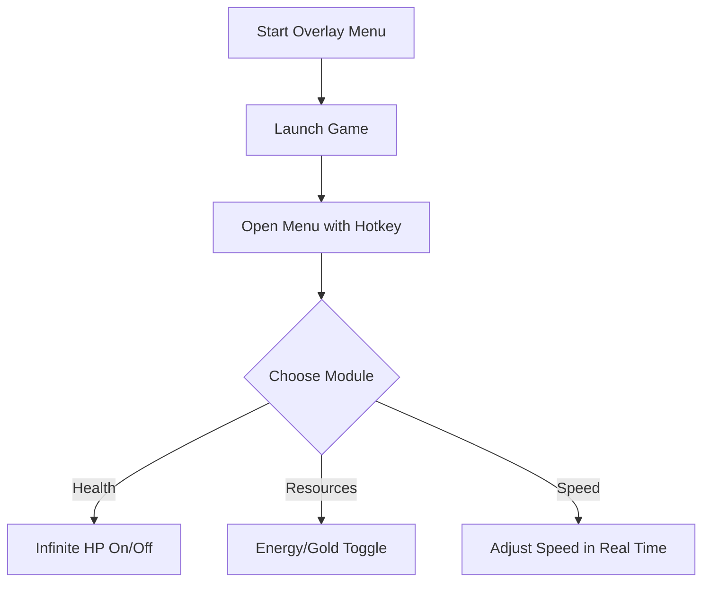

# Shape of Dreams Overlay Menu 🌌

The **Shape of Dreams Overlay Menu** provides a clean, customizable interface for controlling your trainer modules without tabbing out of the game. Instead of memorizing hotkeys, you can use this in-game overlay to toggle features like health boosts, speed adjustments, and resource scaling—all in real time.

---

## 📝 Overview

Shape of Dreams is a world of atmosphere and challenge, but sometimes you want the freedom to **experiment and practice**. The overlay menu makes it easy to manage your trainer tools directly on screen, ensuring seamless adjustments during exploration or combat.

\[!IMPORTANT]
The overlay does not alter game files. It runs in memory and is fully reversible once disabled.

[](#)
[](#)
[](#)
[](#)

---

## ⭐ Features

* **On-Screen Toggle Menu** – Manage trainer functions live, no need to exit.
* **Custom Layouts** – Drag and drop modules to arrange your UI.
* **Transparency Options** – Adjust opacity for minimal screen distraction.
* **Color-Coded Modules** – Health, resources, and speed each use unique colors.
* **Mouse & Keyboard Input** – Navigate overlay with either input method.
* **Profile Saving** – Save your menu setup for future sessions.

---

## 🖥 Compatibility

| Platform       | Supported | Notes                            |
| -------------- | --------- | -------------------------------- |
| Windows 10/11  | ✅         | Full support                     |
| Steam Deck     | ⚠️        | Overlay works, but input limited |
| Linux (Proton) | ⚠️        | Requires tweaks                  |
| macOS          | ❌         | Not available                    |

\[!NOTE]
Accessibility: Fonts and menu sizes can be scaled for larger or smaller displays.

---

## ⚡ Setup Guide

1. **Download** the overlay-enabled trainer package.
2. Copy files into your Shape of Dreams install directory.
3. Run `OverlayMenu.exe` before launching the game.
4. Press `F1` to open the overlay inside Shape of Dreams.
5. Toggle modules directly via the on-screen interface.

```ini
[overlay]
theme=dark
opacity=0.75
position=top_left
hotkey_open=F1
```

---

## 🔄 Overlay Flow



---

## ❓ FAQ

**Q: Does the overlay interfere with graphics performance?**
A: No, it’s lightweight and optimized to run alongside Shape of Dreams.

**Q: Can I resize the overlay?**
A: Yes, you can scale UI elements and reposition modules anywhere on screen.

**Q: Do I need hotkeys if I have the overlay?**
A: Hotkeys still work, but the overlay provides visual toggles for convenience.

**Q: Can I save multiple overlay setups?**
A: Yes, profiles let you keep different layouts and module preferences.

**Q: Does this work with controller input?**
A: Controllers play the game, but overlay navigation requires mouse/keyboard.

---

## 🚀 Final Thoughts

The **Shape of Dreams Overlay Menu** is perfect for players who want **visual control, flexibility, and efficiency**. With real-time toggles, transparency adjustments, and profile saving, it makes managing trainer modules smoother than ever.


---
